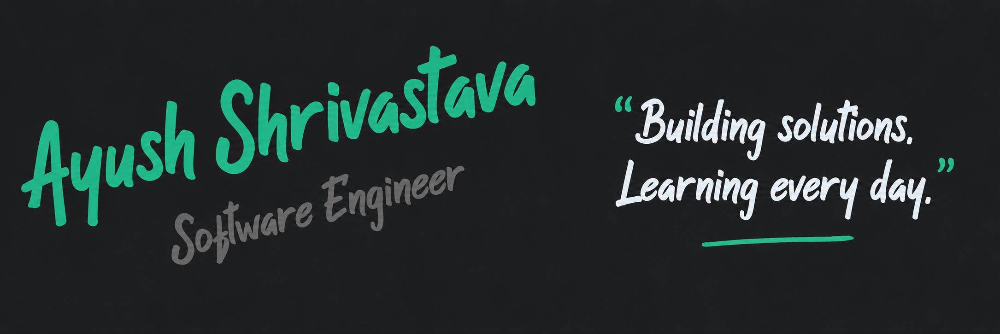

---

## About Me

- B.Tech CSE @ **Vellore Institute of Technology, Chennai**
- Interned at **BPCL** — built a real-time PPE detection system for 300+ refinery workers using YOLOv8
- Full-Stack Developer @ **WebForge** — shipping production apps with React, Next.js & cloud backends
- Published on **IEEE Xplore** — [Real-Time Autonomous Drone Detection Using YOLOv5 and Tracking in Multi-Modal Sensor Fusion Techniques](https://ieeexplore.ieee.org/document/11411200).
- Published on **IEEE Xplore** — [Pixels to Purity: AI-Powered Hyperspectral Analysis for Pesticide-Free Produce](https://ieeexplore.ieee.org/document/11466019). 
- [**Microsoft Certified: Azure AI Fundamentals (AI-900)**](https://www.credly.com/badges/11a5e3fb-d3b0-4fa2-ae11-e0f2e842f263)
- Portfolio: [ayushportfolio-henna.vercel.app](https://ayushportfolio-henna.vercel.app)

---

## Tech Stack

### Languages

### Frontend & Mobile

### Backend & Databases

### AI / ML & CV

### Tools & DevOps

---

## Featured Projects

| Project | Stack | Highlights |
|---------|-------|------------|
| **PPE Detection System** | YOLOv8 · Flask · SQLite · IIS | Real-time safety monitoring for 300+ BPCL workers; 40% faster detection |
| **KwikPic – AI Face Organizer** | Python · OpenCV · dlib · Scikit-learn | 93%+ accuracy clustering 1000+ faces; packaged as one-click Windows installer |
| **SymtoMap – Health Risk AI** | XGBoost · Flask · Blender · JS | Multi-condition health predictor with interactive 3D organ visualization |
| **ARQ+ – AR Flashcard Platform** | Next.js 14 · TypeScript · MongoDB · Cloudinary | AR business cards with anchored media (YouTube, audio, social); live on Vercel |
| **Smart Grocery App** | Flutter · Dart · Firebase | Cross-platform app with offline-first arch, AI suggestions & GPS; live on Android |

---

## GitHub Stats

  
  

---

## Connect

